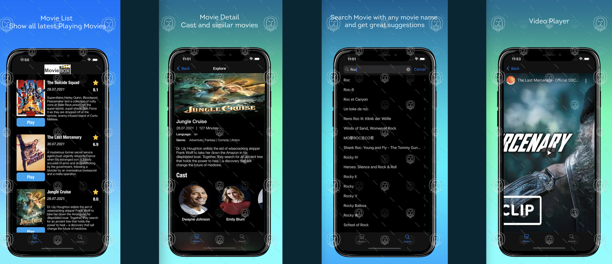

# MovieBox

## Requirements

- Swift 4.2
- Xcode 11 or greater
- iOS 13.0 or greater

## Installation

### CocoaPods

## Usage

### Set the API key
To retrieve a key follow instructions https://developers.themoviedb.org/3/getting-started/authentication
"replace your TMDB api key with TMDB_API_KEY "keyword" in project file"
  
### Call API

##App UI Screen:

1- App Screenshots

## Author
- LinkedIn:[@Dinesh](https://www.linkedin.com/in/idktanwar/)
- Gtihub [@Dinesh](https://github.com/idktanwar/)

## License
@copyright dk@2021
